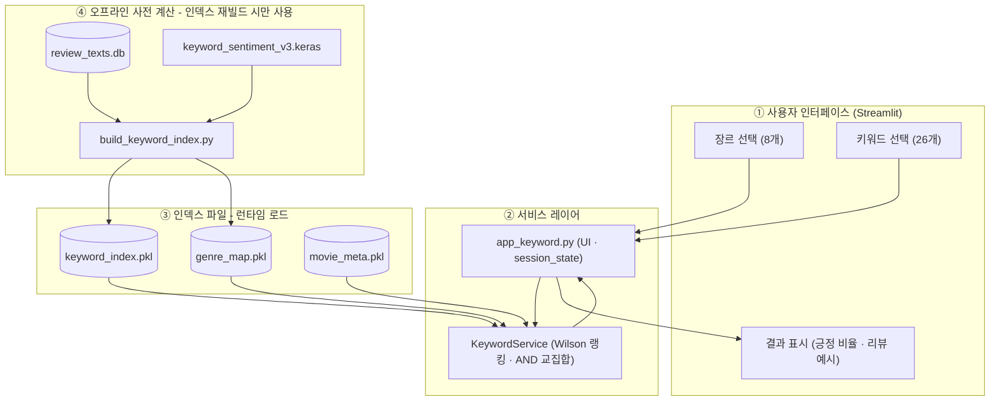
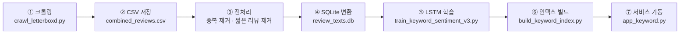
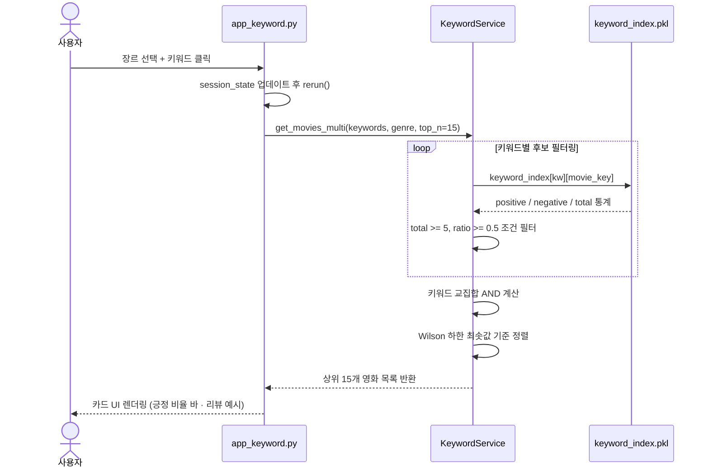
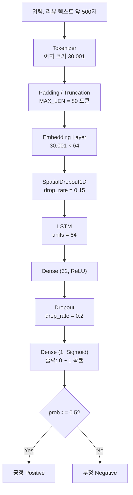

# Technical Report: 영화 키워드 감성 추천 서비스

## 1. 서비스 개요

장르를 고르고 키워드를 클릭하면, 그 키워드가 **긍정적으로 언급된 영화**를 추천하는 서비스다. 핵심은 리뷰 평점이 아니라 특정 요소에 대한 감성을 판별한다는 점이다.

예를 들어 "scary"라는 단어가 들어간 리뷰라도:
- "So scary that I couldn't sleep for days, loved every moment" → 긍정 (0.732)
- "It tried to be scary but completely failed" → 부정 (0.038)

이 차이는 평점만으로는 잡을 수 없다. 8점 리뷰도 특정 요소에 대해선 부정적일 수 있다.

---

## 2. 시스템 설계

### 2.1 전체 아키텍처

서비스는 4개 계층으로 구성된다.

- **사용자 인터페이스 계층**: Streamlit이 렌더링하는 장르 선택·키워드 클릭 UI. 버튼 클릭 시 `st.session_state`에 선택 키워드를 누적하고 `st.rerun()`으로 즉시 갱신한다.
- **서비스 계층**: `KeywordService`가 인덱스를 조회하고 Wilson 랭킹을 적용해 결과를 반환한다. `app_keyword.py`는 UI 렌더링과 세션 관리를 담당한다.
- **인덱스 계층**: 사전 계산된 pkl 파일 3개. `@st.cache_resource`로 서버 시작 시 한 번만 로드하며, 런타임 모델 추론 없이 즉시 응답한다.
- **오프라인 계층**: 인덱스를 생성하기 위한 원본 데이터와 LSTM 모델. 서비스 운영 중에는 접근하지 않으며, 인덱스 재빌드(`build_keyword_index.py`) 시에만 사용된다.



**설계 의도**: 서비스 응답 속도를 위해 런타임 모델 추론을 완전히 제거했다. 키워드별 긍정/부정 통계는 오프라인에서 사전 계산해 pickle로 저장하고, 서비스는 pkl 3개만 로드해 Wilson 랭킹 계산과 필터링만 수행한다. 덕분에 키워드 선택 → 결과 반환이 수십 밀리초 내에 처리된다.

---

### 2.2 데이터 파이프라인

크롤링부터 서비스 기동까지 총 6단계로 구성된다. 각 단계의 출력이 다음 단계의 입력이 되는 선형 파이프라인이다.



| 단계 | 스크립트 | 입력 | 출력 | 소요 시간 |
|------|---------|------|------|---------|
| 크롤링 | `crawl_letterboxd.py` | Letterboxd 웹 페이지 | CSV | 수일 |
| 전처리 | `_filter_*.py`, `merge_csv.py` | CSV | 정제 CSV | 수 시간 |
| SQLite 변환 | `insert_movies.py` | CSV | `review_texts.db` + pkl | ~1시간 |
| LSTM 학습 | `train_keyword_sentiment_v3.py` | DB + pkl | `.keras` 모델 | ~50분 |
| 인덱스 빌드 | `build_keyword_index.py` | DB + `.keras` | `keyword_index.pkl`, `genre_map.pkl` | ~60분 |
| 서비스 기동 | `app_keyword.py` | pkl × 3 | Streamlit 앱 | 즉시 |

크롤링과 학습은 최초 1회만 실행하면 된다. 이후 서비스 재시작은 pkl 로드만 하므로 수 초 내에 완료된다.

---

### 2.3 서비스 요청 흐름

사용자가 키워드를 클릭한 시점부터 결과 카드가 렌더링되기까지의 내부 호출 순서다.



단일 키워드 선택 시에는 `get_movies()`, 복수 선택 시에는 `get_movies_multi()`를 호출한다. 복수 키워드의 경우 각 키워드에서 조건을 만족하는 영화 집합의 **교집합**만 남기고, 랭킹 점수는 각 키워드 Wilson 점수 중 **최솟값**을 사용한다. 가장 약한 항목이 발목을 잡지 않도록 "모든 면에서 고르게 좋은" 영화를 상위로 올리는 설계다.

---

### 2.4 LSTM 모델 구조



**레이어별 역할**

| 레이어 | 파라미터 | 역할 |
|--------|---------|------|
| Embedding | 30,001 × 64 | 단어 인덱스 → 64차원 밀집 벡터 변환. 유사한 문맥의 단어끼리 가까운 벡터를 학습 |
| SpatialDropout1D (0.15) | drop_rate=0.15 | 임베딩 채널 단위로 dropout. 개별 값 dropout보다 순환망과 결합 시 과적합 억제 효과가 높음 |
| LSTM (64 units) | ~33k params | 토큰 시퀀스를 순서대로 처리하며 장기 의존성을 학습. "so scary that I **loved** it"에서 먼 거리에 있는 긍정 신호를 포착 |
| Dense (32, ReLU) | 64→32 | LSTM 출력을 추가 변환. 비선형 특징 조합 |
| Dropout (0.2) | drop_rate=0.2 | 학습 시 뉴런 20% 무작위 비활성화. 테스트 시에는 전체 활성 |
| Dense (1, Sigmoid) | 32→1 | 이진 분류 확률 출력. 0.5 임계값으로 긍정/부정 판정 |

GRU가 아닌 LSTM을 선택한 이유와 SpatialDropout의 효과는 9.2절에서 상세히 다룬다.

---

## 3. 데이터 수집

### 3.1 수집 대상

Letterboxd에서 1960년~2026년 연도별 인기 상위 400편씩 영화를 선정하고, 각 영화의 리뷰를 전량 수집했다.

### 3.2 크롤러 구조 (`crawl_letterboxd.py`)

두 가지 도구를 조합했다.

**영화 목록 수집: undetected-chromedriver**
```
letterboxd.com/films/year/{year}/by/popular/page/{page}/
```
Letterboxd가 Cloudflare를 사용하기 때문에 일반 requests로는 차단된다. undetected-chromedriver로 실제 브라우저처럼 동작시켜 영화 목록 페이지를 크롤링했다. 페이지당 연도별 인기 영화가 나열되며, `data-item-slug`와 `data-item-name` 속성에서 슬러그와 제목을 추출했다.

**리뷰 수집: curl_cffi AsyncSession**
영화 목록 수집 후 실제 리뷰 페이지는 비동기로 수집했다. curl_cffi는 브라우저 TLS 핑거프린트를 흉내내어 Cloudflare를 통과한다.

```python
CONCURRENT_MOVIES = 2   # 동시 처리 영화 수
GLOBAL_SEM        = 12  # 전체 동시 요청 수 캡
```

동시에 12개 요청을 보내되, 영화당 6페이지씩 병렬 처리하는 방식이다.

**평점 변환**
Letterboxd는 별점(★★★½)으로 표현한다. 이를 10점 척도로 변환했다.
```
full_stars * 2 + half * 1 → 1.0~10.0
```

**중복 제거 및 저장**
영화 제목 + 리뷰 텍스트를 기준으로 중복을 제거하고, 청크 단위로 CSV에 append 저장했다. 기존 파일이 있으면 이어서 수집한다.

### 3.3 수집 결과

| 항목 | 값 |
|------|-----|
| 최종 리뷰 수 | 40,217,722건 |
| 영화 수 | 26,761편 |
| 평점 분포 | 1-3점: 3.6% / 4-7점: 25.7% / 8-10점: 52.6% |
| 저장 형식 | SQLite (텍스트) + pickle (메타데이터) |

---

## 4. 벡터 인덱스 구축 (`_embed.py`)

수집된 CSV를 바탕으로 유사 리뷰 검색을 위한 FAISS 인덱스를 구축했다. 이 인덱스는 키워드 감성 서비스와는 별개로 기존 의미 검색 시스템에서 사용된다.

### 4.1 임베딩 모델

BGE-M3 (BAAI/bge-m3)를 사용했다. 다국어 트랜스포머 기반 모델로 한/영 혼합 리뷰를 단일 모델로 처리할 수 있다.

```python
model = BGEM3FlagModel('BAAI/bge-m3', use_fp16=True, device='cuda')
# 256차원, FP16, GPU 연산
vecs = model.encode(texts, batch_size=128, max_length=512, return_dense=True)['dense_vecs'][:, :256]
```

### 4.2 FAISS 인덱스 구조

3단계로 빌드했다.

**Phase 1: IVF-PQ 학습**
100만 건 샘플로 IVF-PQ 양자화기를 사전 학습한다.

```python
quantizer    = faiss.IndexFlatIP(DIM)          # 내적 기반 거리
index_review = faiss.IndexIVFPQ(quantizer, 256, 8192, 16, 8)
# NLIST=8192, M_PQ=16 (256/16=16 서브벡터), NBITS=8
```

IVF(Inverted File Index)는 벡터를 8192개 클러스터로 나눠 검색 시 일부 클러스터만 탐색한다. PQ(Product Quantization)는 각 서브벡터를 256가지 코드로 압축한다. 인덱스 크기와 검색 속도를 동시에 줄이는 구조다.

**Phase 2: 전체 리뷰 임베딩 및 추가**
4천만 건 전체를 임베딩하고 인덱스에 추가하면서, 영화별 리뷰 통계와 메타데이터를 수집했다.

메모리 문제를 피하기 위해 review_meta를 메모리에 누적하지 않고 TSV 파일로 스트리밍 저장한 뒤 변환했다. CSV 읽기 병목을 줄이기 위해 백그라운드 프리페치 큐를 사용했다.

```python
def csv_prefetch_iter(src, chunksize, prefetch=3):
    q = queue.Queue(maxsize=prefetch)
    def reader():
        for chunk in pd.read_csv(src, chunksize=chunksize):
            q.put(chunk)
        q.put(sentinel)
    threading.Thread(target=reader, daemon=True).start()
```

**Phase 3: 영화 평균 벡터 인덱스**
영화별로 리뷰 벡터를 평균 내어 영화 수준 인덱스를 구축했다. 리뷰 50개 미만 영화는 제외.

```python
v = (vec_sum / count).astype('float32')
v /= np.linalg.norm(v) + 1e-10  # L2 정규화
```

---

## 5. 감성 분류 모델 (기존 시스템용: `_train_sentiment_64.py`)

키워드 서비스와 별개로 기존 의미 검색 서비스에는 3-클래스 GRU 감성 분류기가 사용된다.

### 5.1 학습 데이터

평점 7~8점 리뷰(긍정)와 3~4점 리뷰(부정)를 각 50만 건씩 수집했다. 9~10점과 1~2점 극단값은 트롤 리뷰 가능성이 있어 학습에서 제외하고 테스트셋으로만 활용했다.

### 5.2 모델 구조

```python
Sequential([
    Embedding(40001, 64, input_length=100),
    GRU(64),
    Dense(32, activation='tanh'),
    Dense(2, activation='softmax')
])
# optimizer: RMSprop(lr=0.001)
# loss: categorical_crossentropy
```

### 5.3 추론 방식 (`search.py`)

```python
neg_probs = preds[:, 0]      # softmax 부정 클래스 확률
labels[neg_probs >= 0.7] = -1  # 부정
labels[neg_probs <= 0.4] = 1   # 긍정
# 0.4 ~ 0.7 구간: 중립 (판단 보류)
```

중립을 별도로 두어 판단이 불확실한 리뷰가 결과에 영향 주지 않도록 했다. 한국어 리뷰와 60단어 이하 짧은 리뷰도 중립으로 처리한다.

---

## 6. 키워드 감성 분류 모델 (`train_keyword_sentiment.py`)

새 키워드 추천 서비스를 위해 별도 LSTM 이진 분류기를 학습했다.

### 6.1 학습 데이터 설계

핵심 결정: **리뷰 전문을 학습 데이터로 사용한다.**

처음 시도한 방법은 리뷰에서 키워드 포함 문장만 추출하고 그 리뷰의 전체 평점을 레이블로 쓰는 것이었다. 결과적으로 학습이 되지 않았다(loss 0.693 고정, 50% 정확도). 원인은 레이블 불일치 — 8점 리뷰의 한 문장이 특정 요소에 대해 부정적일 수 있다. 이 노이즈가 너무 많으면 모델이 패턴을 찾을 수 없다.

해결책: 리뷰 전문의 평점은 전체 감성과 일치하므로, 문장 추출을 없애고 리뷰 전문(앞 500자)을 그대로 사용했다.

```python
TARGET_PER_CLASS = 80_000

# 긍정: 평점 9-10점 리뷰
pos_ids = [i for i, (_, r) in enumerate(review_meta) if r >= 9]
# 부정: 평점 1-2점 리뷰
neg_ids = [i for i, (_, r) in enumerate(review_meta) if r <= 2]

# SQLite에서 리뷰 텍스트 수집
def collect_reviews(review_ids, target):
    for batch in ...:
        cur.execute("SELECT id, text FROM reviews WHERE id IN (...)", batch)
        for _, text in cur.fetchall():
            if _cjk_re.search(text) or len(text.split()) < 10:
                continue          # 한국어/짧은 리뷰 제외
            collected.append(text[:500])  # 앞 500자
```

평점 기준도 8-10/1-3에서 9-10/1-2로 더 엄격하게 적용해 레이블 신뢰도를 높였다.

### 6.2 모델 구조

```python
Sequential([
    Embedding(30001, 64),
    SpatialDropout1D(0.15),
    LSTM(64),
    Dense(32, activation='relu'),
    Dropout(0.2),
    Dense(1, activation='sigmoid'),
])
# optimizer: Adam(lr=0.001)
# loss: binary_crossentropy
# MAX_LEN=80, VOCAB_SIZE=30000, BATCH=64
```

SpatialDropout1D는 임베딩 전체 채널을 dropout해 임베딩 레이어의 과적합을 억제한다.

### 6.3 학습 과정

160,000건(각 클래스 80,000건)을 90/10 비율로 학습/테스트 분리했다.

```
Epoch 1  val_accuracy: 0.5892
Epoch 2  val_accuracy: 0.8320  ← 급격한 수렴
Epoch 3  val_accuracy: 0.8478  ← 최고점
Epoch 4  val_accuracy: 0.8480
Epoch 5  val_accuracy: 0.8408  ← val_loss 상승 시작
Epoch 6  val_accuracy: 0.8394  ← EarlyStopping 발동
```

EarlyStopping(patience=3, monitor='val_loss')으로 최적 가중치를 보존했다.

### 6.4 평가 결과

**테스트셋 (16,000건)**

| 클래스 | precision | recall | f1-score |
|--------|-----------|--------|----------|
| 부정   | 0.85      | 0.83   | 0.84     |
| 긍정   | 0.83      | 0.85   | 0.84     |
| 전체   | 0.84      | 0.84   | 0.84     |

**문장 수준 일반화 (리뷰 전문이 아닌 단일 문장에 적용)**

리뷰 전문으로 학습했지만, 키워드 포함 문장 단위에도 잘 일반화된다.

| 문장 | 판정 | 확률 |
|------|------|------|
| The acting was absolutely phenomenal and captivating | 긍정 | 0.982 |
| The acting was terrible and wooden throughout | 부정 | 0.019 |
| So scary that I couldn't sleep for days, loved every moment | 긍정 | 0.732 |
| It tried to be scary but completely failed | 부정 | 0.038 |
| The story was beautifully crafted and original | 긍정 | 0.949 |
| Boring and predictable from start to finish | 부정 | 0.018 |
| The cinematography was breathtaking and stunning | 긍정 | 0.942 |
| Disappointing sequel that ruined everything | 부정 | 0.026 |

8건 전체 정확 분류.

---

## 7. 키워드 인덱스 사전 계산 (`build_keyword_index.py`)

서비스 응답 속도를 위해 리뷰 수 상위 3,000개 영화에 대해 키워드별 감성을 미리 계산해두었다.

### 7.1 처리 흐름

```python
for movie_key in top_3000:
    # SQLite에서 영화 리뷰 최대 500건 조회
    cur.execute("SELECT id, text FROM reviews WHERE id IN (...)")
    
    # 키워드 포함 문장 추출
    for text in reviews:
        for sent in split_by_punctuation(text):
            if keyword_pattern.search(sent) and 5 <= len(sent.split()) <= 60:
                all_sentences.append((keyword, sent))
    
    # LSTM으로 배치 추론
    probs = model.predict(padded, batch_size=512)
    
    # 키워드별 긍정/부정 집계
    for (kw, sent), prob in zip(all_sentences, probs):
        if prob >= 0.5:
            stats[kw][movie]['positive'] += 1
        else:
            stats[kw][movie]['negative'] += 1
```

### 7.2 장르 분류

영화 메타데이터에 장르가 없어서 리뷰에서 장르 키워드 빈도로 자동 분류했다.

```python
GENRE_KEYWORDS = {
    'Horror':    ['horror', 'scary', 'terrifying', 'creepy', 'ghost', ...],
    'Comedy':    ['comedy', 'funny', 'hilarious', 'humor', 'laugh', ...],
    'Romance':   ['romance', 'romantic', 'love story', 'chemistry'],
    'Action':    ['action', 'fight scene', 'battle', 'explosion', ...],
    'Thriller':  ['thriller', 'suspense', 'mystery', 'crime', ...],
    'Sci-Fi':    ['sci-fi', 'science fiction', 'futuristic', 'alien', ...],
    'Animation': ['animated', 'animation', 'pixar', 'cartoon', ...],
    'Drama':     ['drama', 'dramatic'],
}
```

리뷰의 3% 이상에서 해당 장르 키워드가 등장하면 해당 장르로 분류한다. 한 영화가 복수 장르에 속할 수 있다.

### 7.3 결과

| 장르 | 영화 수 | 주요 키워드 |
|------|---------|------------|
| Comedy | 1,252 | funny, original, entertaining, acting |
| Action | 924 | original, entertaining, acting |
| Horror | 915 | original, dark, acting, scary |
| Thriller | 776 | acting, dark, original, twist |
| Drama | 471 | acting, emotional, cinematography |
| Romance | 386 | funny, romantic, acting |
| Sci-Fi | 285 | original, acting, boring, visuals |
| Animation | 225 | original, funny, emotional, visuals |

키워드별 커버 영화 수 (mentions ≥ 3 기준):
- acting: 2,786편 / entertaining: 2,308편 / funny: 2,302편 / scary: 808편

---

## 8. 서비스 레이어 (`keyword_service.py`, `app_keyword.py`)

### 8.1 KeywordService

`keyword_index.pkl`은 7절에서 LSTM이 분류한 결과다(키워드별 긍정/부정 문장 수). 서비스는 이 모델 출력을 서빙하며, 속도를 위해 런타임 재추론만 생략한다 — 매 요청마다 모델을 다시 부르지 않고, 사전 계산된 pkl 3개만 로드한다.

```python
class KeywordService:
    def __init__(self):
        self.keyword_index = pickle.load('keyword_index.pkl')  # 키워드별 영화 감성 통계
        self.genre_map     = pickle.load('genre_map.pkl')      # 장르별 영화 목록
        self.movie_meta    = pickle.load('movie_meta.pkl')     # 영화 메타데이터

    def get_movies(self, keyword, genre=None, top_n=20, min_mentions=5):
        candidates = self.keyword_index[keyword]
        if genre:
            genre_movies = set(self.genre_map[genre]['movies'])
            candidates = {k: v for k, v in candidates.items() if k in genre_movies}
        ranked = []
        for k, v in candidates.items():
            if v['total'] < min_mentions:
                continue
            score = wilson_lower_bound(v['positive'], v['total'])
            ranked.append((k, v, score))
        ranked.sort(key=lambda x: x[2], reverse=True)
```

정렬 기준은 단순 긍정 비율이 아니라 **Wilson 신뢰구간 하한**이다. 이유는 9.5절 참조.

### 8.2 Streamlit UI

```
사이드바: 장르 라디오 버튼 (8개)
메인: 키워드 버튼 (카테고리별 — 분위기/감정/스토리/연기기술)
클릭 시: session_state에 선택 키워드 저장 → 결과 표시
```

영화별로 긍정 비율을 색상으로 표시한다 (70%+ 초록 / 50%+ 노랑 / 이하 빨강).

---

## 9. 발생한 문제와 해결 과정

### 9.1 서비스 설계 방향 전환

처음엔 리뷰에서 영화의 무드를 분류하는 모델을 만들었다. 학습 레이블을 키워드 매칭으로 생성했는데, 서비스에서도 키워드 매칭만으로 같은 결과를 낼 수 있었다. 모델이 불필요했다.

→ 방향을 바꿔 "키워드가 긍정적으로 언급되었는가"를 판별하는 구조로 전환했다. 이 판단은 키워드 존재 여부나 전체 평점으로 할 수 없으므로, 모델이 실질적으로 필요한 구조가 됐다.

### 9.2 GRU 학습 불가 버그

처음에 GRU를 썼더니 loss가 0.6931에서 움직이지 않았다 (50% 정확도). 합성 데이터로 아키텍처를 비교했다.

| 아키텍처 | 검증 정확도 |
|----------|-----------|
| GRU | 50% |
| LSTM | 100% |
| GlobalAveragePooling1D | 100% |
| Bidirectional LSTM | 100% |

GRU만 학습이 안 됐다. TensorFlow 2.20 / Keras 3 환경에서의 버그로 판단하고 LSTM으로 교체했다.

### 9.3 문장 단위 학습 데이터 노이즈

키워드 포함 문장을 추출하고 리뷰 전체 평점을 레이블로 쓰면, 한 리뷰 내 개별 문장의 실제 감성과 레이블이 불일치하는 경우가 많아 학습이 수렴하지 않았다.

→ 리뷰 전문을 학습 데이터로 사용했다. 리뷰 전체 감성은 평점과 일치하므로 레이블 신뢰도가 높다. 이 방식으로 전환 후 84%까지 수렴했다.

### 9.4 도메인 특화 키워드의 모호성

"scary"처럼 부정적 의미를 내포한 단어도 공포영화 팬에게는 긍정적 맥락에서 사용된다. 학습 데이터가 30K일 때는 "So scary that I couldn't sleep, exactly what I wanted" 같은 문장을 부정(0.277)으로 잘못 분류했다.

→ 학습 데이터를 80K로 늘렸다. 더 많은 데이터를 통해 "loved", "wanted" 같은 긍정 신호가 "scary" 같은 표면적 부정 단어를 override하는 패턴을 학습했다. 동일 문장이 0.732(긍정)로 정상 분류됐다.

### 9.5 작은 표본이 랭킹 상위를 독점하는 문제

초기 정렬 기준은 `(긍정 비율, 언급 수)`였다. 그런데 실제로 구동해보니 상위 결과가 언급 3~5건짜리 100% 영화로 채워졌다. 긍정 비율만으로 정렬하면 3/3(100%)이 30/34(88%)보다 무조건 위로 간다. "리뷰 2개짜리 별점 5점이 리뷰 1000개짜리 별점 4.8점을 이기는" 전형적 문제다.

**측정된 실제 데이터:**

| 키워드 | 100% 긍정 영화 수 | 이들의 언급 수 중앙값 |
|--------|-----------------|-------------------|
| scary | 67개 | 3건 |
| funny | 183개 | 4건 |
| acting | 212개 | 5건 |

`min_mentions=3` 기준 Horror+scary 상위에는 언급 5~8건짜리 100% 영화만 뜨고, *To All the Boys I've Loved Before*(로맨스), *The Muppet Christmas Carol* 같은 오분류·저표본 결과가 상위를 차지했다.

**해결:** 정렬 기준을 **Wilson 신뢰구간 하한(95%)**으로 교체했다.

```python
def wilson_lower_bound(positive, total, z=1.96):
    if total == 0:
        return 0.0
    phat = positive / total
    denom = 1 + z*z/total
    center = phat + z*z/(2*total)
    margin = z * math.sqrt((phat*(1-phat) + z*z/(4*total)) / total)
    return (center - margin) / denom
```

Wilson 하한은 표본이 작을수록 비율을 보수적으로 깎는다.

| 긍정/전체 | 단순 비율 | Wilson 하한 |
|-----------|----------|------------|
| 3/3 | 100% | 0.438 |
| 10/10 | 100% | 0.722 |
| 30/34 | 88% | 0.734 |
| 14/16 | 88% | 0.640 |

30/34(88%)가 10/10(100%)보다 위로 가고, 3/3은 하위로 밀린다. 표본 크기가 자연스럽게 랭킹에 반영된다.

**개선 전후 (Drama + acting 상위 3개):**

| 순위 | 개선 전 (ratio 정렬) | 개선 후 (Wilson 정렬) |
|------|--------------------|---------------------|
| 1 | The Remains of the Day (22/22) | The Remains of the Day (22/22) |
| 2 | The Aviator (19/19) | The Aviator (19/19) |
| 3 | The Verdict (17/17) | Mystic River (40/43) ← 큰 표본 상승 |

Doubt(89/104), 12 Years a Slave(20/21) 등 표본이 크고 비율도 높은 연기 명작들이 상위로 올라왔다. 최소 언급 기준도 3→5로 올려 노이즈 하한을 강화했다.

### 9.6 다의어(polysemy)로 인한 장르 오분류

Wilson 랭킹 적용 후에도 Horror+scary 상위에 *To All the Boys I've Loved Before*(로맨스), *The Muppet Christmas Carol* 같은 비-공포 영화가 남았다. 원인은 감성이 아니라 **장르 분류**에 있었다.

장르는 리뷰의 장르 키워드 빈도로 자동 분류하는데, Horror 키워드에 `scary`가 포함되어 있었다. 문제는 `scary`가 다의어라는 점이다:
- "the ghost scenes were scary" → 공포 (진짜 신호)
- "love is scary", "scary how relatable this is" → 감정적/관용적 (공포 아님)

로맨스·드라마 리뷰의 관용적 "scary" 때문에 이들이 Horror로 분류됐다.

**핵심 판단은 "scary를 빼면 진짜 공포영화도 빠지지 않는가?"였다.** 측정으로 검증했다.

현재 Horror로 분류된 915개 영화에 대해, scary를 제외한 공포 키워드(horror, terrifying, gore, creepy, ghost, zombie...)만으로 3% 문턱을 재적용한 결과:

| 구분 | 영화 수 |
|------|---------|
| scary 없이도 유지 | 886개 (96.8%) |
| scary 빠지면 탈락 | 29개 (3.2%) |

탈락한 29개를 확인하니 **진짜 공포영화가 하나도 없었다**: La La Land(뮤지컬), To All the Boys(로맨스), Dr. Strangelove(풍자), 1917/Inglourious Basterds(전쟁), Grave of the Fireflies(전쟁 애니), Hotel Rwanda·127 Hours·Poor Things(드라마) 등. 전부 "scary"를 관용적으로 쓴 오분류였다. 반대로 The Conjuring는 "horror"가 리뷰의 31%, REC는 28%에 등장하는 등, 진짜 공포영화에서 scary는 잉여 신호였다.

**해결:** 장르 분류 키워드에서만 `scary`를 제외했다. (서비스 클릭 키워드로는 유지 — 모든 영화의 scary 감성은 그대로 계산된다.)

```python
# 변경 전
'Horror': ['horror', 'scary', 'terrifying', 'creepy', 'haunting', ...]
# 변경 후
'Horror': ['horror', 'terrifying', 'creepy', 'haunting', ...]
```

재계산 후 Horror는 915→873개가 되었고, Horror+scary 상위 목록에서 To All the Boys·Muppet Christmas Carol이 사라지고 The Others, His House, REC, Perfect Blue, The Vanishing 등 실제 공포영화만 남았다.

---

### 9.7 부정 의미 키워드 제외

키워드 중 boring/predictable/overrated/disappointing은 "긍정적으로 언급"이 성립하지 않는다. 이 단어들은 리뷰에서 대부분 불평으로 쓰여, 모델이 78~97%를 부정으로 분류한다.

| 키워드 | 긍정 비율 | 긍정 추천 가능 영화 |
|--------|----------|------------------|
| boring | 3% | 1 |
| disappointing | 6% | 1 |
| overrated | 16% | 2 |
| predictable | 22% | 45 |

"칭찬받는 지루함"은 성립하지 않으므로 긍정 추천으로 뽑히는 영화가 1~2개뿐이고, 그마저 주변 문맥으로 인한 오분류가 섞인다(예: "Pulp Fiction tends to be overrated"가 긍정으로 분류). 반면 정상 aspect는 칭찬/비판이 실제로 갈린다(funny 62%, acting 59%, dialogue 47%).

해결: 위 4개를 클릭 키워드 목록(`KEYWORD_CATEGORIES`)에서 제외했다. 인덱스 데이터가 아니라 UI 노출만 막으므로 재계산은 불필요하다. 나머지 26개 키워드만 노출한다.

---

## 10. 테스트

### 10.1 환경

| 항목 | 값 |
|------|-----|
| OS | Windows 11 (10.0.26200) |
| CPU / RAM | Intel i7-12700 (20 논리코어) / 64GB |
| GPU | LSTM 학습·추론은 미사용 (CPU) |
| Python | 3.9.25 |
| TensorFlow / Keras | 2.20.0 / 3.10.0 |
| NumPy / scikit-learn | 1.26.4 / 1.6.1 |

BGE-M3 임베딩과 FAISS 인덱스 구축(4절)은 별도 CUDA GPU 환경에서 수행했다. 키워드 LSTM 모델은 위 CPU 환경에서 학습·추론한다.

### 10.2 모델 평가

학습 데이터 16만 건을 9:1로 나눠 테스트셋 1.6만 건으로 평가했다(6.4절). 정확도 84%. 리뷰 전문으로 학습한 모델이 문장 단위에도 일반화되는지 예시 문장 8건으로 확인했고 전건 정답이었다.

### 10.3 서비스 테스트

`test_keyword.py`로 모델과 서비스를 검증한다. 실행: `python test_keyword.py --full`

| 그룹 | 항목 수 | 검증 내용 |
|------|--------|----------|
| 긍정 문장 | 6 | 긍정 문장이 0.5 이상 |
| 부정 문장 | 6 | 부정 문장이 0.5 미만 |
| 대조쌍 | 3 | 같은 키워드에서 긍정 문장 > 부정 문장 |
| 서비스 통합 | 8 | 장르 8개 로드, 키워드별·장르별 추천 반환 확인 |

결과: 23건 전건 통과. Streamlit 앱은 브라우저에서 장르 선택→키워드 클릭→추천 표시 흐름을 실행해 서버·콘솔 오류 없음을 확인했다.

---

### 10.4 평점 기준 비교 및 IMDB 외부 검증

학습 데이터의 평점 기준을 바꿔 두 모델을 비교했다. 아키텍처와 데이터량(16만)은 동일하다.
- **v1**: 긍정 9~10 / 부정 1~2 (극단 평점)
- **v2**: 긍정 8~9 / 부정 2~3 (양극단 1·10 제외 — 트롤·과장 배제 목적)

**같은 평점 홀드아웃에서 교차 평가:**

| 테스트셋 | v1 | v2 |
|----------|-----|-----|
| 극단 (9-10 vs 1-2) | 84.6% | 84.2% |
| 완만 (8-9 vs 2-3) | 79.8% | 81.1% |

각 모델이 자기가 학습한 분포에서 근소 우위다. 완만한 평점 구간이 극단보다 정확도가 낮은데, 중간 평점 리뷰의 감성 언어가 더 모호하기 때문이다.

**IMDB 5만 건(사람 라벨) 외부 검증** — 평점이 아니라 사람이 직접 긍/부정을 매긴 데이터라 외부 기준으로 신뢰도가 높다. 재현: `python eval_imdb_keyword.py`

| 검증셋 | v1 | v2 |
|--------|-----|-----|
| 전체 50,000 | 80.1% | 81.0% |
| 짧은 리뷰 ≤80단어 (4,072) | 88.5% | 89.4% |

사람 라벨 기준에서는 v2가 근소하게 앞서고 precision/recall이 더 균형적이다(v1은 부정 recall 0.856 / 긍정 recall 0.746으로 부정 쪽 편향). 서비스가 실제로 분류하는 짧은 문장(≤80토큰) 영역에서는 두 모델 모두 ~89%로, 이 구간이 실사용 성능에 가장 가깝다.

**결론:** 두 모델은 실질적으로 동급(±1%)이다. 극단·완만 어느 평점 기준을 써도 유효하며, 현재 서비스는 v1 인덱스를 사용하고 v2는 `keyword_sentiment_v2.keras`로 별도 보관한다.

---

## 11. 한계

**추천 풀의 범위 제한**

키워드 인덱스는 리뷰 수 기준 상위 3,000편만 대상으로 사전 계산된다(`build_keyword_index.py: TOP_MOVIES = 3000`). 전체 수집 영화 ~18,000편 중 나머지 15,000편은 키워드 적중 여부와 무관하게 결과에 노출되지 않는다. 컬트 명작이나 저예산 독립 영화처럼 리뷰 수는 적지만 키워드 감성이 강한 작품이 묻히는 문제가 있다. 리뷰 수가 적은 영화는 Wilson 하한이 낮아 어차피 상위에 오르기 어렵다는 점에서 실질적 영향은 제한적이나, 추천 풀 자체가 인기작 편향을 가진다는 구조적 한계는 남는다.

**문장 단위 일반화의 구조적 한계**

모델이 리뷰 전문으로 학습되었기 때문에, 긍정 신호가 희박한 짧은 문장에서는 오분류 가능성이 있다. "Exactly what I wanted from a horror movie"처럼 도메인 지식이 필요한 표현은 여전히 부정으로 잘못 분류될 수 있다.

서비스에서는 영화 전체 리뷰에 걸쳐 긍정 비율을 집계하고 Wilson 하한으로 랭크하므로 개별 문장 오분류의 영향이 희석된다. 표본이 작은 영화는 Wilson 하한이 자동으로 낮아져 상위에서 밀려나므로, 오분류에 취약한 저표본 결과가 노출될 확률이 낮다.

**장르 분류의 잔존 다의어 문제**

`scary` 제외로 가장 두드러진 오분류는 해결했으나(8.6절), 같은 다의어 문제가 다른 단어에도 남아 있다. 예를 들어 *La La Land*(뮤지컬)는 "haunting melody"(여운 있는 선율)의 `haunting` 때문에 여전히 Horror 버킷에 남는다. 다만 이런 영화는 scary 긍정 언급 자체가 적어 Wilson 점수가 낮으므로 **Horror+scary 결과 목록에는 노출되지 않는다** — 버킷 소속은 부정확해도 사용자 화면에는 영향이 없다.

근본적으로는 단어 의미 구분(word-sense disambiguation)이 필요한 문제로, `haunting`/`nightmare` 등도 측정 후 동일하게 제외하면 버킷 자체를 더 정제할 수 있다. 현재는 결과 품질에 영향이 없어 감수한다.
